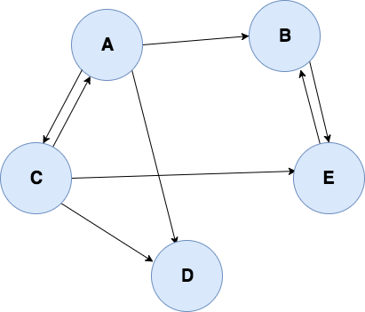

# What is a graph

A graph is a set of nodes called *vertices* and connections called *edges* connecting the different vertices.
Graphs are used to represent networks

In a tree (binary or N-ary), a node can only be connected to its parent and children. In a graph, each vertex can be connected to every other vertex of the graph

a graph is composed of what we call vertices or vertexes or nodes and a connection between this nodes is called an edge

# Type of graphs

## Unidirect graph
A graph is called *unidirect* when all edges are bidirectional, meaning that if a vertex A is connected to a vertex B. then B is connected to A.

A social network like **facebook** can be represented using a undirected graph:
    * each vertex represents a person
    * On facebook, if a person A is a friend of a person B, then they are both connected, we can represent these connections with bidirectional edges.

## Directed graph
On the other hand, a graph is called directed when at least one edge is unidirectional, meaning that if a vertex A is connected to a vertex B, then B is no neccesarily connected to A (But it can be, through another edge).

Other social networks like **Twitter** or **Instagram** can be represented using directed grapsh:
    * each vertex represents a person
    * A person A can follow a person B, but it does not necessarily mean that B follow A back, Such a connection between A and B can be represented using a unidirectional edge.

## Weighted graphs
Another possible property of a graph is that its edges can be given a weight.

we can easily understand the purpose of weighted graphs with a graph representing the time to travel between cities:
    * Each vertex is a city
    * the distance is divided by the average speed limit between two cities give us the time it takes to travel between two cities. if we use time as weight of the edge between two vertices, we can build a graph that can be used to determine the fastest way to go from city A to city X.

## Trees
a tree is a unidirected graph with no cycles. Equivalently, it is a connected graph with N nodes and N-1 edges.

## Rooted trees
A rooted tree is a tree with a designated root node where every edge either points away from or towards the root node. When edges point away from the root the graph is called an arborescence (out-tree) and anti-arborescence (in-tree) otherwise.

## Directed Acyclic Graphs (DAGs)
DAGs are directed graphs with no cycles. These graphs play an important role in representing structures with dependencies. Several efficient algorithms exist to operates on DAGs.
fact: All out-trees are DAGs but not all DAGs are out-trees.

## Bipartite Graph
A bipartite graph is one whose vertices can be split into two independant groups U and V such that every edge connects between U and V.

## complete graph
A complete graph is one where there is a unique edge between every pair of nodes. a complete graph w N vertices is denoted as the graph Kn.

# Graph representation

## Basic adjacency list

An adjacency list is an array of vertex structures. Each vertex structure contains the data of the vertex, and a pointer to the head node of a linked list. Each node of this linked list represents an edge. An edge structure contains the index of the connected vertex in the vertices array, and a pointer to the next edge in the linked list.

```c
typedef struct edge_s
{
    int dest_index;
    struct edge_s *next;
} edge_t;

typedef struct vertex_s
{
    /* structure content */
    edge_t *edges_head;
} vertex_t;

vertex_t graph[NB_VERTICES];
```

## Adjacency linked list

same as the adjacency list described just above, but instead of having an array of vertices, we are going to use a linked a list of vertices. The reason is that to be able to add vertices to the graph, without having to realloc the entire array every time.

on top of that, we are going to store more informations in our vertex structure:
    * we will store it's number of edges.
    * we will also store it's index in the adjacency list. this will help us for future algorithms.
